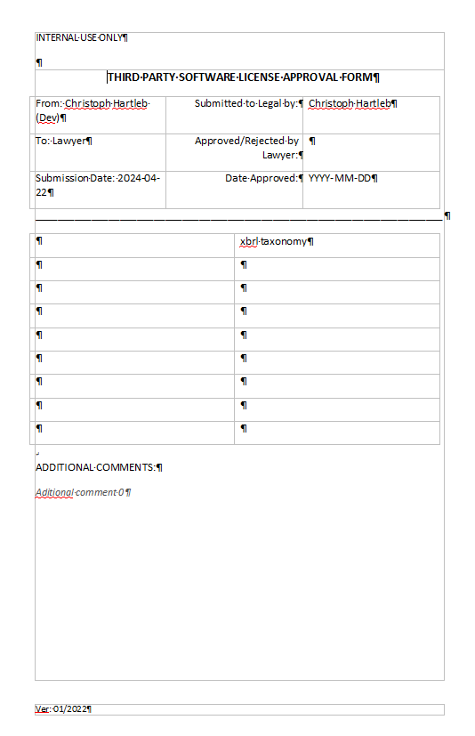

# XBRL Taxonomy License File Creator

## :newspaper: About the project

Craft your license file with ease using our sleek command-line tool! Simply generate a customizable template in seconds. Check out our sample in the `lics/` folder for inspiration.

### Content overview

    .
    ├── img/ - folder where all the images can be found for the application
    ├── lics/ - folder where the license files are generated into
    ├── CODE_OF_CONDUCT.md - project code of conduct
    ├── Constants.py - contains all constants for the program
    ├── COPYRIGHT - project copyright
    ├── gen_lic_approval.py main program and code designing and generating the file
    ├── README.md - relevant information about the project
    ├── LICENSE - license text
    └── requirements.txt - requirements to run the project

## :runner: Getting started

0. Clone the project to a location of your choice:

```sh
git clone https://github.com/CH6832/license-file-creator.git
```

1. Install relevant requirements:

```sh
pip3 install -r requirements.txt
```

2. Run the script with parameters of you need to generate a license approval file:

```sh
python3 gen_lic_approval.py -family='eba' -version="3.2"
```

3. If the file has been generated:

```sh
Document successfully generated!
--------------------------------
Your generated file: filebasename 3.2 XBRL Taxonomy - Third Party Software License Approval Form YYYYMMDD.docx can be found at './YYYY-MM-DD/'
```

4. The result can be found in the `lics/` folder and looks like this:



## :books: Resources used to create this project

* Python
  * [Python 3.12 documentation](https://docs.python.org/3/)
  * [Built-in Functions](https://docs.python.org/3/library/functions.html)
  * [Python Module Index](https://docs.python.org/3/py-modindex.html)
* Markdwon
  * [Basic syntax](https://www.markdownguide.org/basic-syntax/)
  * [Complete list of github markdown emofis](https://dev.to/nikolab/complete-list-of-github-markdown-emoji-markup-5aia)
  * [Awesome template](http://github.com/Human-Activity-Recognition/blob/main/README.md)
  * [.gitignore file](https://git-scm.com/docs/gitignore)
* Editor
  * [PyCharm Community Edition](https://www.jetbrains.com/pycharm/)

## :bookmark: License

This project is licensed under the terms of the [GPL v3](LICENSE).

## :copyright: Copyright

See the [COPYRIGHT](COPYRIGHT) file for copyright and licensing details.

## :straight_ruler: Code of Conduct

Please review our [Code of Conduct](CODE_OF_CONDUCT.md) before contributing to this project.
